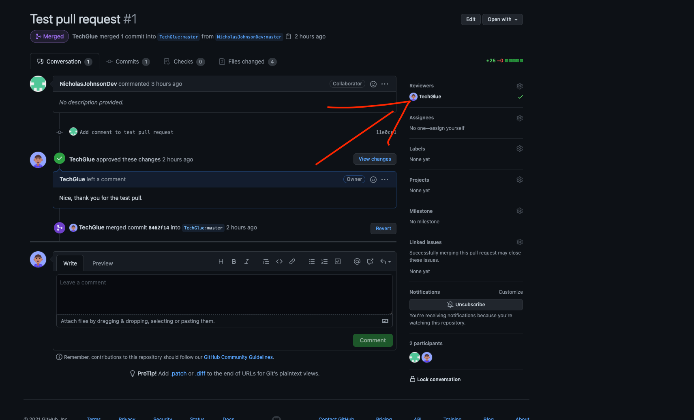

# Group 16 Contributing Guide

1. **Never work from the master branch.** The master branch will be reserved for our deployable product. When adding a new feature please create a **new branch**. Branch names should always have some type of meaning.
    - Always name branches using the following template initials-method worked on. EX. lg-deltewindow.
    
2. I'll (Luis) be in charge of reviewing the pull requests and merging them to the main branch. You are allowed to make the commits freely. But, **please try to avoid committing anything to the main branch before running it by the team.**

3. When submitting a pull requests please give a brief description of what the changes do and the name of the method you implemented. Also, **once you submitted your pull please request that I (Luis) look over your pull.** This is so I can get notified and easily look over what requests need to get reviewed and approved.

That's all there is to it. Let's communicate often and don't hesitate to drop any issues in the Discord. **It's better that we resolve issues earlier rather than later. Let's make this a great Team Project!**

